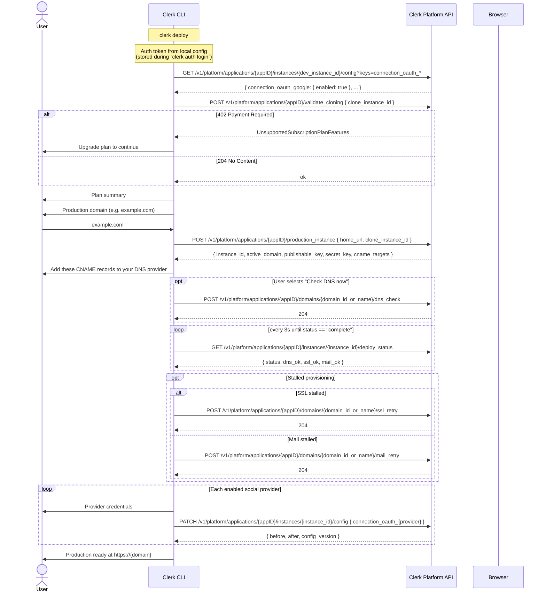

# Deploy Command

> **Live PLAPI lifecycle.** Human mode resolves the linked application, production domains, deploy status, and instance config from the Platform API on each run. The production-instance lifecycle calls (`validate_cloning`, `production_instance`, `deploy_status`, `dns_check`, `ssl_retry`, `mail_retry`) call the helpers in `lib/plapi.ts` directly. PLAPI error codes are translated to typed `CliError`s by `commands/deploy/errors.ts`.

Guides a user through deploying their Clerk application to production.

## Usage

```sh
clerk deploy              # Interactive, idempotent wizard (human mode)
clerk deploy --debug      # With debug output
clerk deploy --mode agent # Exit with human-mode-required guidance
```

## Options

| Flag      | Purpose                                      |
| --------- | -------------------------------------------- |
| `--debug` | Show detailed deploy and PLAPI debug output. |

## Agent Mode

When running in agent mode (`--mode agent`, `CLERK_MODE=agent`, or non-TTY context), this command exits with a usage error explaining that human mode is required. Production deploy configuration depends on interactive prompts for domain, DNS, and OAuth credential collection, so agents should hand off to a human-run terminal session.

Agent mode is detected via the mode system (`src/mode.ts`), which checks in priority order:

1. `--mode` CLI flag
2. `CLERK_MODE` environment variable
3. TTY detection (`process.stdout.isTTY`)

Agent mode does not call PLAPI and exits before the human-mode wizard starts.

## PLAPI Lifecycle

Human mode reads and writes deploy state through the Platform API on every run. The CLI does not persist deploy progress locally — the only profile write is the ordinary `instances.production` value once the production instance has been created.

| Step                       | Endpoint                                                                     | Behavior                                                                                                                          |
| -------------------------- | ---------------------------------------------------------------------------- | --------------------------------------------------------------------------------------------------------------------------------- |
| Validate cloning           | `POST /v1/platform/applications/{appID}/validate_cloning`                    | 204 on success. 402 `unsupported_subscription_plan_features` → `ERROR_CODE.PLAN_INSUFFICIENT` listing missing features.           |
| Create production instance | `POST /v1/platform/applications/{appID}/production_instance`                 | Returns `instance_id`, `environment_type`, `active_domain`, `publishable_key`, `secret_key` (once), and `cname_targets[]`.        |
|                            |                                                                              | 409 `production_instance_exists` → CLI re-derives state via `fetchApplication` and falls through to `reconcileExistingDeploy`.    |
| Trigger DNS check          | `POST /v1/platform/applications/{appID}/domains/{domainIDOrName}/dns_check`  | Fired best-effort once per "Check DNS now" selection to actively kick the check job. Idempotent (no-op if a check is in flight).  |
| Poll deploy status         | `GET /v1/platform/applications/{appID}/instances/{envOrInsID}/deploy_status` | Returns `status` plus the three component booleans `dns_ok`, `ssl_ok`, `mail_ok`. CLI polls every 3s up to ~5 minutes.            |
| Retry SSL provisioning     | `POST /v1/platform/applications/{appID}/domains/{domainIDOrName}/ssl_retry`  | 204 on success. 409 `ssl_retry_throttled` carries `meta.retry_after_seconds` (12-min per-domain throttle).                        |
| Retry mail verification    | `POST /v1/platform/applications/{appID}/domains/{domainIDOrName}/mail_retry` | 204 on success. 409 `mail_retry_inflight` → poll `deploy_status`. 403 `operation_not_allowed_on_satellite_domain` for satellites. |
| Save OAuth credentials     | `PATCH /v1/platform/applications/{appID}/instances/{instanceID}/config`      | Returns the updated config snapshot. Used to persist production `connection_oauth_*` credentials.                                 |

PLAPI errors are translated to typed `CliError`s by `commands/deploy/errors.ts`. The CLI does not auto-retry SSL or mail provisioning — when `deploy_status` polling times out with `ssl_ok` or `mail_ok` still false, the CLI surfaces the component status and instructs the user to rerun `clerk deploy` once DNS propagates.

If the user presses Ctrl-C after the production instance has been created, the wizard tells them to run `clerk deploy` again and exits with SIGINT code 130. The next run derives the current DNS or OAuth step from API state and resumes without starting another production instance.

## Sequence Diagram



## API Endpoints

All endpoints are on the **Platform API** (`/v1/platform/...`) and are live HTTP calls. The deploy command calls the helpers in `lib/plapi.ts` directly.

| Step                       | Method  | Endpoint                                                                 | Helper                                                                                                                   |
| -------------------------- | ------- | ------------------------------------------------------------------------ | ------------------------------------------------------------------------------------------------------------------------ |
| Auth                       | n/a     | Local config                                                             | Token stored from `clerk auth login` or `CLERK_PLATFORM_API_KEY`.                                                        |
| Read instance config       | `GET`   | `/v1/platform/applications/{appID}/instances/{instanceID}/config`        | `fetchInstanceConfig` from `lib/plapi.ts`. Discovers enabled `connection_oauth_*` providers.                             |
| Patch instance config      | `PATCH` | `/v1/platform/applications/{appID}/instances/{instanceID}/config`        | `patchInstanceConfig`. Writes production OAuth credentials.                                                              |
| Read application           | `GET`   | `/v1/platform/applications/{appID}`                                      | `fetchApplication`. Resolves development and production instance IDs.                                                    |
| List production domains    | `GET`   | `/v1/platform/applications/{appID}/domains`                              | `listApplicationDomains`. Recovers production domain name and CNAME targets on each run.                                 |
| Validate cloning           | `POST`  | `/v1/platform/applications/{appID}/validate_cloning`                     | `validateCloning`. Pre-flights subscription/feature support.                                                             |
| Create production instance | `POST`  | `/v1/platform/applications/{appID}/production_instance`                  | `createProductionInstance`. Returns prod instance, primary domain, keys, and `cname_targets[]`.                          |
| Trigger DNS check          | `POST`  | `/v1/platform/applications/{appID}/domains/{domainIDOrName}/dns_check`   | `triggerDomainDnsCheck`. Fired best-effort when the user picks "Check DNS now" to actively kick the check job.           |
| Poll deploy status         | `GET`   | `/v1/platform/applications/{appID}/instances/{envOrInsID}/deploy_status` | `getDeployStatus`. Polls every 3s; surfaces `dns_ok`/`ssl_ok`/`mail_ok` to the user on timeout.                          |
| Retry SSL provisioning     | `POST`  | `/v1/platform/applications/{appID}/domains/{domainIDOrName}/ssl_retry`   | `retryApplicationDomainSSL`. Exposed on the API surface; not invoked from the deploy flow yet (handled by re-running).   |
| Retry mail verification    | `POST`  | `/v1/platform/applications/{appID}/domains/{domainIDOrName}/mail_retry`  | `retryApplicationDomainMail`. Same — rejected on satellite domains with 403 `operation_not_allowed_on_satellite_domain`. |

## OAuth Provider Config Format

Config keys follow the pattern `connection_oauth_{provider}`. When writing credentials to a production instance:

```json
PATCH /v1/platform/applications/{appID}/instances/production/config

{
  "connection_oauth_google": {
    "enabled": true,
    "client_id": "123456789-abc.apps.googleusercontent.com",
    "client_secret": "GOCSPX-..."
  }
}
```

### Provider-specific required fields

| Provider  | Required Fields                                                  |
| --------- | ---------------------------------------------------------------- |
| Google    | `client_id`, `client_secret`                                     |
| GitHub    | `client_id`, `client_secret`                                     |
| Microsoft | `client_id`, `client_secret`                                     |
| Apple     | `client_id`, `team_id`, `key_id`, `client_secret` (.p8 contents) |
| Linear    | `client_id`, `client_secret`                                     |

Production instances return `422` if you try to enable a provider without credentials.

### Google OAuth `client_id` validation

Google enforces a pattern: `^[0-9]+-[a-z0-9]+\.apps\.googleusercontent\.com$`

### Google OAuth JSON import

For Google, the wizard offers `Load credentials from a Google Cloud Console JSON file`. It reads the `client_id` and `client_secret` from the top-level `web` object in the downloaded OAuth client JSON, or from `installed` for desktop-style client downloads. The file contents are used in memory and are not written to CLI config.

## Helpful values for OAuth walkthrough

When the user chooses the guided walkthrough, these values are derived from their domain:

| Field                         | Value                                         |
| ----------------------------- | --------------------------------------------- |
| Authorized JavaScript origins | `https://{domain}`, `https://www.{domain}`    |
| Authorized redirect URI       | `https://accounts.{domain}/v1/oauth_callback` |
