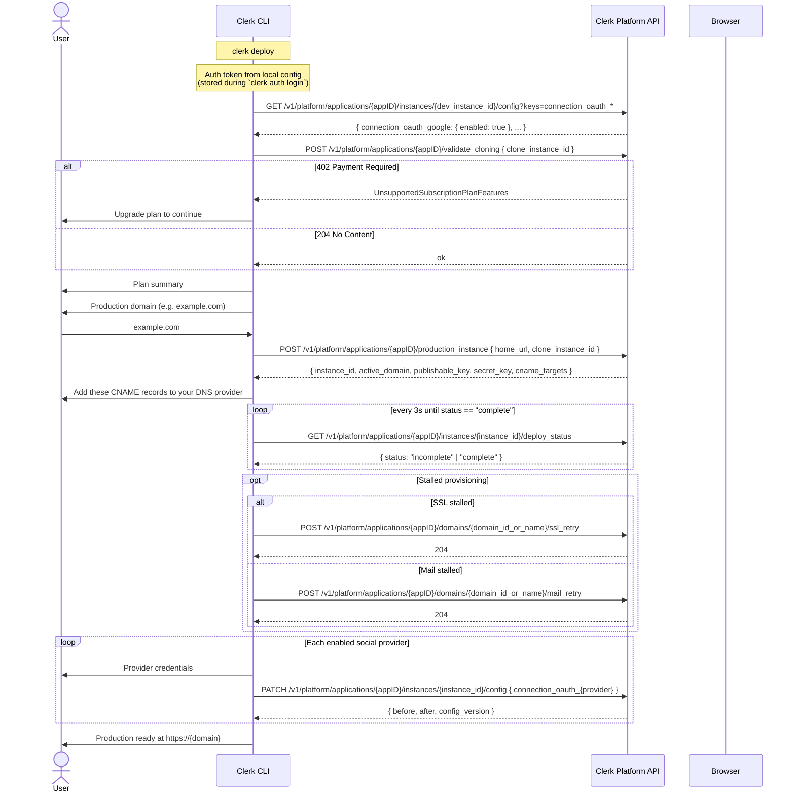

# Deploy Command

> **API-resolved state, mocked lifecycle.** Human mode resolves the linked application, production domains, deploy status, and instance config from the API layer on each run. Application/domain/config reads use live PLAPI helpers; production lifecycle calls (`validate_cloning`, `production_instance`, `deploy_status`, `ssl_retry`, `mail_retry`) plus production config PATCH still go through `commands/deploy/api.ts`, where they are mocked with the real Platform API request/response shapes.

Guides a user through deploying their Clerk application to production.

## Usage

```sh
clerk deploy              # Interactive, idempotent wizard (human mode)
clerk deploy --debug      # With debug output
clerk deploy --mode agent # Exit with human-mode-required guidance
```

## Options

| Flag      | Purpose                                      |
| --------- | -------------------------------------------- |
| `--debug` | Show detailed deploy and PLAPI debug output. |

## Agent Mode

When running in agent mode (`--mode agent`, `CLERK_MODE=agent`, or non-TTY context), this command exits with a usage error explaining that human mode is required. Production deploy configuration depends on interactive prompts for domain, DNS, and OAuth credential collection, so agents should hand off to a human-run terminal session.

Agent mode is detected via the mode system (`src/mode.ts`), which checks in priority order:

1. `--mode` CLI flag
2. `CLERK_MODE` environment variable
3. TTY detection (`process.stdout.isTTY`)

Agent mode does not call PLAPI and exits before the human-mode wizard starts.

## PLAPI And Mocked Lifecycle

Human mode reads deploy state through the API layer: application instances, production domains, development config, production config, and deploy status. It does not write deploy progress to the CLI config profile. The only config compatibility write is the ordinary linked-profile `instances.production` value.

The production-instance lifecycle still calls the helpers in `commands/deploy/api.ts`. They use the exact request/response shapes published in the Platform API OpenAPI spec, but the bodies are produced locally so the wizard can simulate server-side deploy states while the production-instance backend remains mocked.

| Step                       | Endpoint                                                                     | Mocked state                                                                                                                   |
| -------------------------- | ---------------------------------------------------------------------------- | ------------------------------------------------------------------------------------------------------------------------------ |
| Validate cloning           | `POST /v1/platform/applications/{appID}/validate_cloning`                    | Resolves to 204; the helper exists so 402 `UnsupportedSubscriptionPlanFeatures` errors can later short-circuit before summary. |
| Create production instance | `POST /v1/platform/applications/{appID}/production_instance`                 | Returns `instance_id`, `environment_type`, `active_domain`, `publishable_key`, `secret_key`, and `cname_targets[]`.            |
| Poll deploy status         | `GET /v1/platform/applications/{appID}/instances/{envOrInsID}/deploy_status` | Returns `incomplete` for the first two polls per `(appID, instanceID)` pair, then `complete`. CLI polls every 3s.              |
| Retry SSL provisioning     | `POST /v1/platform/applications/{appID}/domains/{domainIDOrName}/ssl_retry`  | Resolves to 204; helper exposed for use when `deploy_status` stalls.                                                           |
| Retry mail verification    | `POST /v1/platform/applications/{appID}/domains/{domainIDOrName}/mail_retry` | Resolves to 204; helper exposed for use when `deploy_status` stalls.                                                           |
| Save OAuth credentials     | `PATCH /v1/platform/applications/{appID}/instances/{instanceID}/config`      | Resolves to `{}` without hitting the network.                                                                                  |

This keeps `clerk deploy` from drifting away from the server-side source of truth once these endpoints are backed by production data. Each run resolves the current production instance, domain, deploy status, and OAuth config from the API layer, then prints a checked-off plan before completing the next unfinished action. Re-running `clerk deploy` after production is fully configured shows every deploy action checked off and prints production next steps.

Mocked lifecycle endpoints in `commands/deploy/api.ts` pause for ~2s before returning so spinners and the deploy-status poll feel like real network calls.

If the user presses Ctrl-C after the production instance has been created, the wizard tells them to run `clerk deploy` again and exits with SIGINT code 130. The next run derives the current DNS or OAuth step from API state and resumes without starting another production instance.

## Sequence Diagram



## API Endpoints

All endpoints are on the **Platform API** (`/v1/platform/...`). The "Real" rows are live HTTP calls today; the "Mock" rows are wired through `commands/deploy/api.ts` with shapes that match the published OpenAPI spec exactly.

| Step                       | Method  | Endpoint                                                                 | Status | Helper                                                                                                                                     |
| -------------------------- | ------- | ------------------------------------------------------------------------ | ------ | ------------------------------------------------------------------------------------------------------------------------------------------ |
| Auth                       | n/a     | Local config                                                             | Real   | Token stored from `clerk auth login` or `CLERK_PLATFORM_API_KEY`.                                                                          |
| Read instance config       | `GET`   | `/v1/platform/applications/{appID}/instances/{instanceID}/config`        | Real   | `fetchInstanceConfig` from `lib/plapi.ts`. Used to discover enabled `connection_oauth_*` providers in dev.                                 |
| Patch instance config      | `PATCH` | `/v1/platform/applications/{appID}/instances/{instanceID}/config`        | Mock   | `patchInstanceConfig` in `commands/deploy/api.ts`. Writes production OAuth credentials once switched to live PLAPI.                        |
| Read application           | `GET`   | `/v1/platform/applications/{appID}`                                      | Real   | `fetchApplication` from `lib/plapi.ts`. Resolves live development and production instance IDs.                                             |
| List production domains    | `GET`   | `/v1/platform/applications/{appID}/domains`                              | Real   | `listApplicationDomains` from `lib/plapi.ts`. Recovers production domain name and CNAME targets on each run.                               |
| Validate cloning           | `POST`  | `/v1/platform/applications/{appID}/validate_cloning`                     | Mock   | `validateCloning` in `commands/deploy/api.ts`. Pre-flights subscription/feature support before plan summary.                               |
| Create production instance | `POST`  | `/v1/platform/applications/{appID}/production_instance`                  | Mock   | `createProductionInstance` in `commands/deploy/api.ts`. Returns prod instance, primary domain, keys, and `cname_targets[]`.                |
| Poll deploy status         | `GET`   | `/v1/platform/applications/{appID}/instances/{envOrInsID}/deploy_status` | Mock   | `getDeployStatus` in `commands/deploy/api.ts`. CLI polls every 3 seconds while the production instance is provisioning DNS, SSL, and mail. |
| Retry SSL provisioning     | `POST`  | `/v1/platform/applications/{appID}/domains/{domainIDOrName}/ssl_retry`   | Mock   | `retryApplicationDomainSSL` in `commands/deploy/api.ts`. Available for surfacing to the user when `deploy_status` stalls.                  |
| Retry mail verification    | `POST`  | `/v1/platform/applications/{appID}/domains/{domainIDOrName}/mail_retry`  | Mock   | `retryApplicationDomainMail` in `commands/deploy/api.ts`. Same as above, for SendGrid mail. Rejected on satellite domains.                 |

## OAuth Provider Config Format

Config keys follow the pattern `connection_oauth_{provider}`. When writing credentials to a production instance:

```json
PATCH /v1/platform/applications/{appID}/instances/production/config

{
  "connection_oauth_google": {
    "enabled": true,
    "client_id": "123456789-abc.apps.googleusercontent.com",
    "client_secret": "GOCSPX-..."
  }
}
```

### Provider-specific required fields

| Provider  | Required Fields                                                  |
| --------- | ---------------------------------------------------------------- |
| Google    | `client_id`, `client_secret`                                     |
| GitHub    | `client_id`, `client_secret`                                     |
| Microsoft | `client_id`, `client_secret`                                     |
| Apple     | `client_id`, `team_id`, `key_id`, `client_secret` (.p8 contents) |
| Linear    | `client_id`, `client_secret`                                     |

Production instances return `422` if you try to enable a provider without credentials.

### Google OAuth `client_id` validation

Google enforces a pattern: `^[0-9]+-[a-z0-9]+\.apps\.googleusercontent\.com$`

### Google OAuth JSON import

For Google, the wizard offers `Load credentials from a Google Cloud Console JSON file`. It reads the `client_id` and `client_secret` from the top-level `web` object in the downloaded OAuth client JSON, or from `installed` for desktop-style client downloads. The file contents are used in memory and are not written to CLI config.

## Helpful values for OAuth walkthrough

When the user chooses the guided walkthrough, these values are derived from their domain:

| Field                         | Value                                         |
| ----------------------------- | --------------------------------------------- |
| Authorized JavaScript origins | `https://{domain}`, `https://www.{domain}`    |
| Authorized redirect URI       | `https://accounts.{domain}/v1/oauth_callback` |
