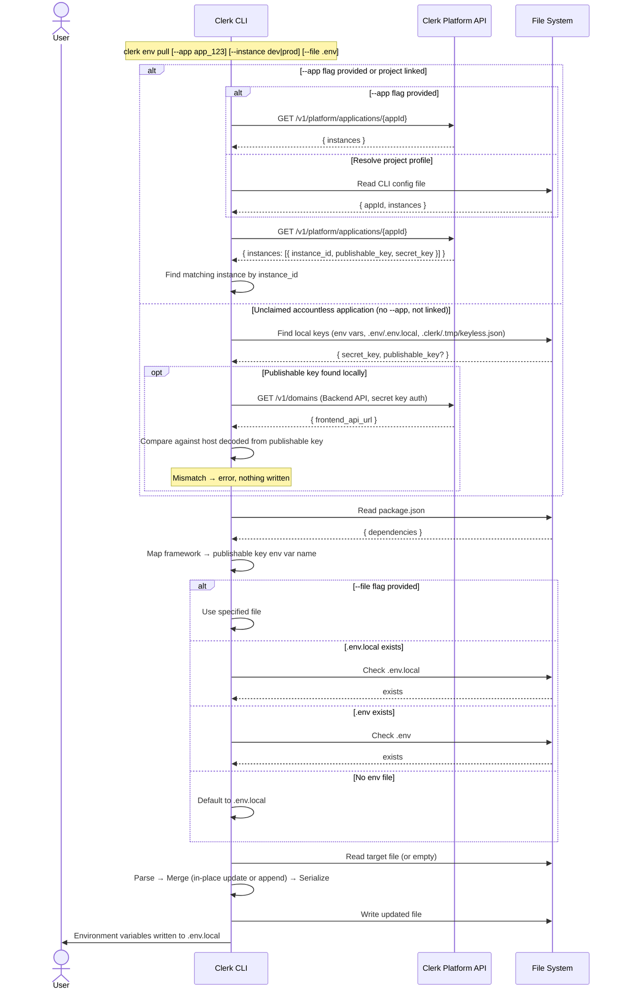

# Env Pull Command

Pulls Clerk API keys for the linked instance and merges them into the project's `.env` file.

For an unclaimed **accountless** application there is no account to pull from — its keys only exist on this machine. When the directory isn't linked and no `--app` is passed, `env pull` instead copies the keys it finds locally (env var, `.env`/`.env.local`, or the `.clerk/.tmp/keyless.json` an SDK wrote for itself) into the env file the framework reads. This is what materializes an SDK-created accountless app into `.env.local`. If only the secret key can be found, it's written and a warning names the missing publishable key. Resolution order lives in [`lib/keyless-target.ts`](../../lib/keyless-target.ts).

The secret key and publishable key are found independently and can each belong to a _different_ application (e.g. leftovers from two accountless apps in the same `.env.local`). Before writing, `env pull` calls `GET /v1/domains` with the secret key and confirms the publishable key's Frontend API host (decoded via `decodePublishableKey` in `lib/fapi.ts`) matches one of that instance's own domains. A mismatch aborts the pull with an error and writes nothing — a wrong pair on disk produces an app that fails at runtime in a way that's very hard to trace, so this is stricter than `clerk whoami`, which only warns about the same mismatch (see [`commands/whoami/README.md`](../whoami/README.md)).

## Usage

```sh
clerk env pull [--app <app_id>] [--instance dev|prod|<instance_id>] [--file <path>]
```

### Options

| Option            | Description                                                         |
| ----------------- | ------------------------------------------------------------------- |
| `--app <id>`      | Application ID to target directly (works from any directory)        |
| `--instance <id>` | Instance to target (`dev`, `prod`, or a full instance ID)           |
| `--file <path>`   | Target env file, relative to cwd or absolute (default: auto-detect) |

## Sequence Diagram



## API Endpoints

| Step                                               | Method | Endpoint                            | Notes                                                                          |
| -------------------------------------------------- | ------ | ----------------------------------- | ------------------------------------------------------------------------------ |
| Auth                                               | —      | Local config                        | Uses `CLERK_PLATFORM_API_KEY`, `clerk auth login`, or human-mode prompt        |
| Fetch application                                  | `GET`  | `/v1/platform/applications/{appId}` | Returns all instances with keys                                                |
| Verify accountless pairing (accountless path only) | `GET`  | `/v1/domains`                       | Only when a local publishable key was found; authenticated with the secret key |

## Framework Detection

Reads `package.json` dependencies to determine the correct publishable key env var name:

| Framework dependency | Env var name                        |
| -------------------- | ----------------------------------- |
| `next`               | `NEXT_PUBLIC_CLERK_PUBLISHABLE_KEY` |
| `expo`               | `EXPO_PUBLIC_CLERK_PUBLISHABLE_KEY` |
| `astro`              | `PUBLIC_CLERK_PUBLISHABLE_KEY`      |
| `nuxt`               | `NUXT_PUBLIC_CLERK_PUBLISHABLE_KEY` |
| `vite`               | `VITE_CLERK_PUBLISHABLE_KEY`        |
| fallback             | `CLERK_PUBLISHABLE_KEY`             |

Priority is top-to-bottom (e.g., a Next.js project that also has Vite will use `NEXT_PUBLIC_*`).

## .env Merge Behavior

- Existing Clerk keys are updated **in-place**, preserving their position in the file
- New keys are appended at the end with a `# Clerk` section header
- Comments, blank lines, and non-Clerk keys are preserved exactly as-is
- File always ends with a trailing newline
