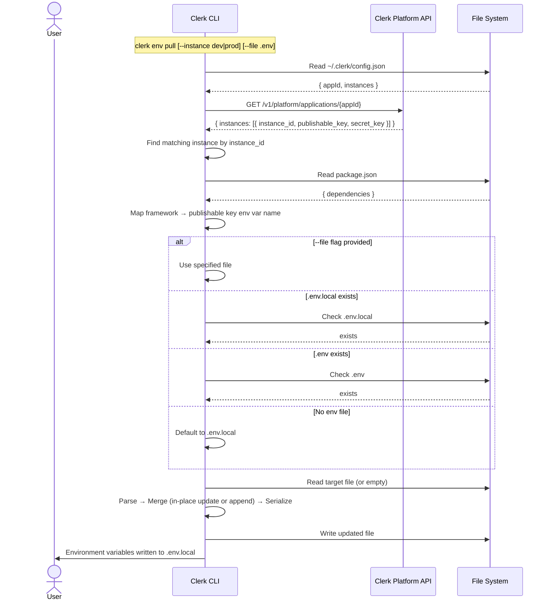

# Env Pull Command

Pulls Clerk API keys for the linked instance and merges them into the project's `.env` file.

## Usage

```
clerk env pull [--instance dev|prod|<instance_id>] [--file <path>]
```

### Options

| Option | Description |
|---|---|
| `--instance <id>` | Instance to target (`dev`, `prod`, or a full instance ID) |
| `--file <path>` | Target env file (default: auto-detect) |

## Sequence Diagram



## API Endpoints

| Step | Method | Endpoint | Notes |
|---|---|---|---|
| Auth | — | Local config | Token from `CLERK_PLATFORM_API_KEY` env var |
| Fetch application | `GET` | `/v1/platform/applications/{appId}` | Returns all instances with keys |

## Framework Detection

Reads `package.json` dependencies to determine the correct publishable key env var name:

| Framework dependency | Env var name |
|---|---|
| `next` | `NEXT_PUBLIC_CLERK_PUBLISHABLE_KEY` |
| `expo` | `EXPO_PUBLIC_CLERK_PUBLISHABLE_KEY` |
| `astro` | `PUBLIC_CLERK_PUBLISHABLE_KEY` |
| `nuxt` | `NUXT_PUBLIC_CLERK_PUBLISHABLE_KEY` |
| `vite` | `VITE_CLERK_PUBLISHABLE_KEY` |
| fallback | `CLERK_PUBLISHABLE_KEY` |

Priority is top-to-bottom (e.g., a Next.js project that also has Vite will use `NEXT_PUBLIC_*`).

## .env Merge Behavior

- Existing Clerk keys are updated **in-place**, preserving their position in the file
- New keys are appended at the end with a `# Clerk` section header
- Comments, blank lines, and non-Clerk keys are preserved exactly as-is
- File always ends with a trailing newline
